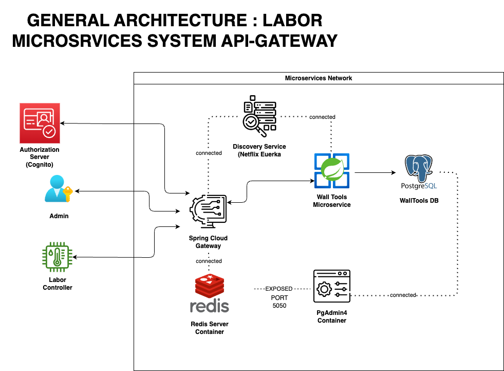

# EXAMPLE (Spring Cloud) : API GATEWAY ARCHITECTURE Microservices For Labor Network

## V1

This project follows the API Gateway architecture and comprises multiple servers. To streamline the process of initializing this network without the necessity of configuring each server individually, we have Dockerized all components of this project within a Docker Compose setup. Additionally, we have provided a Makefile to facilitate performing multiple operations with a single command.

## Project Folders & Files

- walltools-service: This contains the main microservice.
- gateway: This contains the Spring Cloud Gateway project.
- discovery-service: This contains the discovery server project (Eureka Netflix)
- diagrams: This contain the main architecture images
- simulations: contain simulations used to test the backend & written in Python
- ✨[File]: Docker-Compose
- ✨[File]: Makefile

## With Postman

We have added a Postman file in the root of the project, containing all endpoints used in the application.

## Network Components

- Spring Cloud Api-Gateway (App Entry point) - PORT 8080
- Walltools Microservice (The Main Application) - NOT EXPOSED
- Redis Server - PORT 6379
- Discovery Service - PORT 8761
- PgAdmin4 - PORT 5050

## Third-Party Services

Due to time constraints, we had initially planned to build a custom authorization server or use a self-hosted one; however, we really want to present the authorization process through Spring Cloud Gateway so we look for a quick solution for Demonstration purposes which is the third-party identity provider Cognito. We don't have enough time to set up client-side authentication in the frontend, so for demonstration purposes, we'll secure all patch requests on the 'tool' endpoint while leaving other endpoints open to showcase the API Gateway's function as a resource server and how authorization operates.

## Installation for Network (Production Env)

We have made it easy

```sh
In Project root:
make all
make dockerize
docker-compose up
```

NOTE: The 'make' command works on MacOS only. On Windows, it might be necessary to install a terminal that supports this command.

## Run Walltools-service alone (Development Env)

```sh
In Spring Walltool-Service Project
[1] spring.profiles.active=dev // To activate Development Profile
[2]  mvn clean -Pdev spring-boot:run // -Pdev to inject h2 Dependency
```

## Run Gateway alone (Development Env)

```sh
In Spring Gateway-Service Project
[1] spring.profiles.active=dev // To activate Development Profile
[2]  mvn clean spring-boot:run
```

## Discovery-Server

```sh
In Spring Discovery-Server Project
 mvn clean spring-boot:run
```

## Simulations

001_scan_user_concurrent_request_simulation.py: To simulate multiple requests being made to a system simultaneously.

```sh
Inside Simulation folder
 python3 001_scan_user_concurrent_request_simulation.py
```

## Generate Executable Jar for Microservices

```sh
In project Root
make build
```
